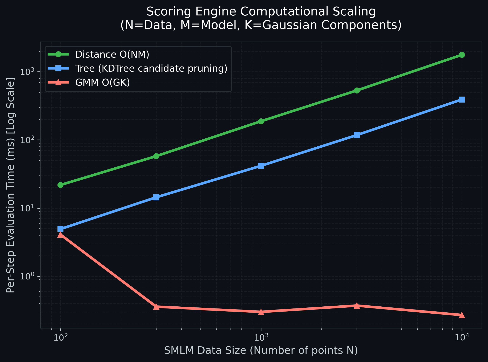

# SMLM-IMP Score

Bayesian scoring of Single-Molecule Localization Microscopy (SMLM) data against Integrative Modeling Platform (IMP) structural models of the Nuclear Pore Complex (NPC).

## Overview

**smlm_score** provides a complete pipeline for evaluating how well a structural model explains experimentally observed SMLM localization patterns. It implements three scoring functions based on Bayesian log-likelihood formulations (Bonomi et al. 2019), supports GPU-accelerated computation, and offers multiple optimization strategies for structural fitting.

## Features

- **Three scoring functions**: Tree (KD-tree), GMM (Gaussian Mixture Model), Distance (pairwise)
- **GPU acceleration**: CUDA kernels via Numba with automatic CPU fallback
- **Three optimization modes**:
  - Brownian Dynamics (geometric relaxation)
  - Conjugate Gradients (frequentist MLE)
  - Replica Exchange Monte Carlo (Bayesian posterior sampling)
- **HDBSCAN clustering**: Automated NPC isolation from dense SMLM fields
- **PCA alignment**: Model-data registration
- **Validation framework**: Separation tests and held-out cross-validation
- **97 pytest tests**: Unit, integration, and robustness coverage

## Installation

### Prerequisites

- Python ≥ 3.11
- [IMP](https://integrativemodeling.org/) with the `IMP.bff` module
- CUDA toolkit (optional, for GPU acceleration)

### Setup

```bash
git clone https://github.com/danielrieger/test.git
cd test
pip install -e .
```

### Environment

This project was developed with a conda-pack environment (Python 3.11). Core dependencies are listed in `requirements.txt`. The IMP library must be installed separately following the [IMP installation guide](https://integrativemodeling.org/nightly/doc/manual/installation.html).

## Input Data

The following large input files are **not included** in this repository. Download them and place them in the indicated directories:

| File | Size | Source | Destination |
|------|------|--------|-------------|
| `7N85-assembly1.cif` | 112 MB | [RCSB PDB: 7N85](https://www.rcsb.org/structure/7N85) | `examples/PDB_Data/` |
| `data.csv` | 29 MB | [ShareLoc repository](https://shareloc.xyz) | `examples/ShareLoc_Data/` |
## Visual Gallery

The pipeline generates publication-quality visualizations for structural alignment and quality control.

````carousel

<!-- slide -->

<!-- slide -->

<!-- slide -->

````

## Performance Benchmarking

A core technical contribution of this work is the implementation of a **Gaussian Mixture Model (GMM)** scoring engine that achieves constant-time evaluation relative to the number of experimental localizations ($N$).

- **Distance/Tree Engines**: Scale linearly $O(N)$ or $O(N \log N)$, becoming a bottleneck at $>10,000$ points.
- **GMM Engine**: After an initial $O(N)$ fitting step, evaluation complexity is $O(GK)$, where $G$ is the number of Gaussians and $K$ is the number of subunits. This results in **constant-time performance** for Bayesian optimization.



## Quick Start

1. **Setup**: Clone the repo and install the environment (see Setup above).
2. **Data**: Place `7N85-assembly1.cif` in `examples/PDB_Data/` and `data.csv` in `examples/ShareLoc_Data/`.
3. **Run Pipeline**: `python examples/NPC_example_BD.py`
4. **Generate Thesis Figures**:
   - `python examples/visualize_alignment_stylized_3d.py` (3D Gallery)
   - `python examples/visualize_gmm_selection.py` (BIC & GMM QC)
   - `python examples/benchmark_scoring.py` (Performance Scaling)

## Project Structure

```
smlm_score/
├── src/
│   ├── imp_modeling/
│   │   ├── scoring/             # Tree, GMM, Distance scoring + CUDA kernels
│   │   └── restraint/           # IMP restraint wrappers (ScoringRestraintWrapper)
│   ├── utility/
│   │   ├── data_handling.py     # Structural ranking, HDBSCAN, PCA alignment
│   │   └── visualization.py     # Stylized 3D (Pyvista) & Publication White themes
├── examples/
│   ├── figures/                 # Categorized Thesis Assets
│   │   ├── methodology/         # 3D, PCA summary, fitting sequences
│   │   ├── benchmarks/          # Scaling and performance plots
│   │   └── qc/                  # GMM BIC selection and top-ranked overlays
│   ├── benchmark_scoring.py     # Performance scaling benchmark
│   └── visualize_gmm_selection.py # Intelligent NPC selection & BIC plots
└── tests/                       # 97 pytest tests
```

## Validation

The validation module implements two tests:
1. **Separation test**: Confirms that density-normalized scores for valid NPC clusters outperform noise/off-target clusters.
2. **Held-out test**: Verifies that the structural signal is captured by comparing scores across spatially disjoint subsets of the same NPC localization cloud.

## License

TBD
), which is the expected behavior.

## Testing

```bash
pytest tests/
```

Expected result: **92 passed, 5 skipped** (skipped tests require CUDA).

## License

TBD

## Citation

TBD
