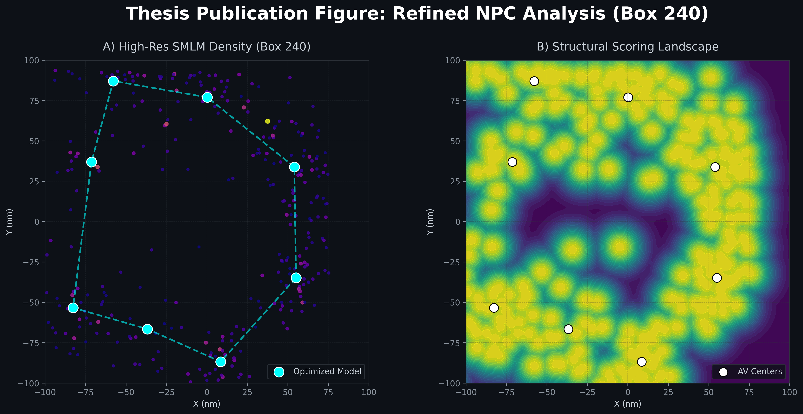
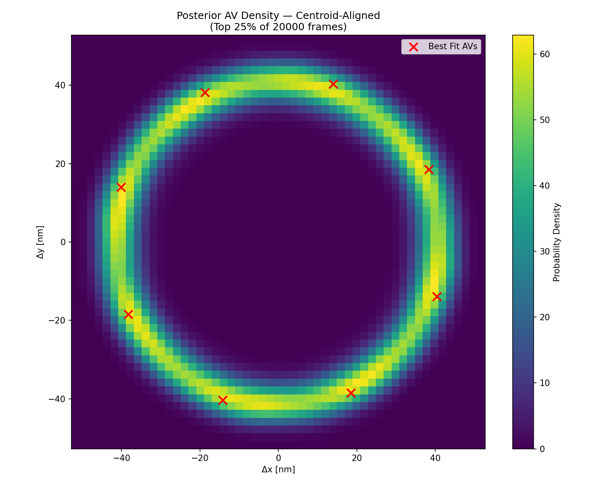
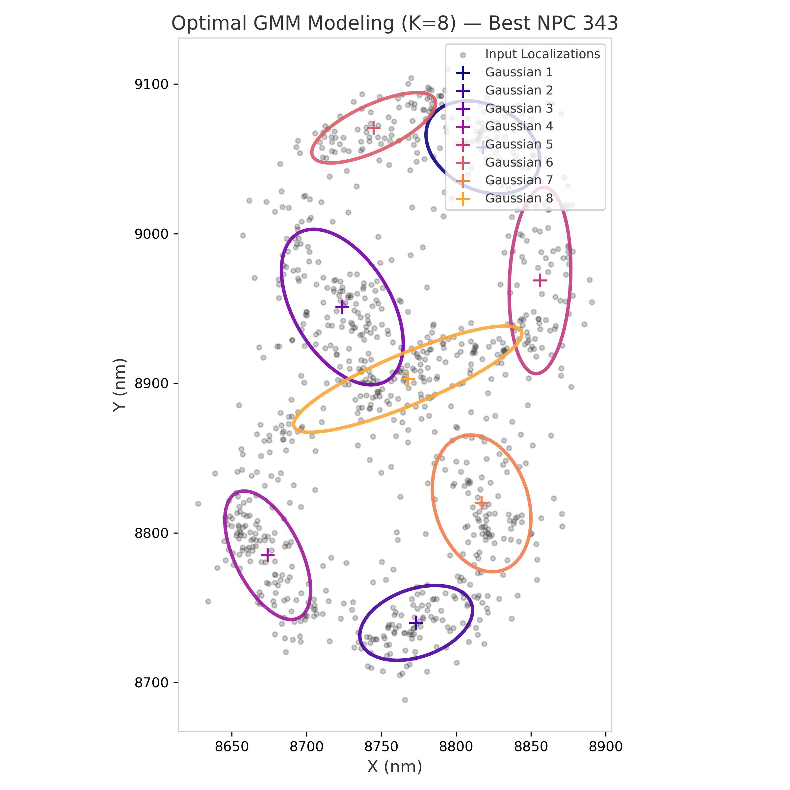
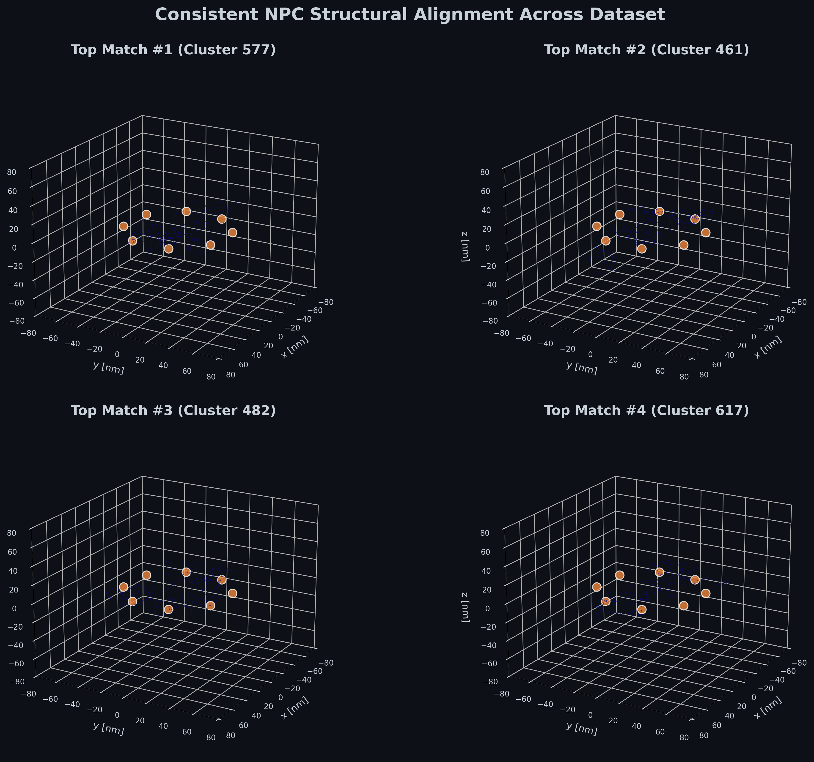
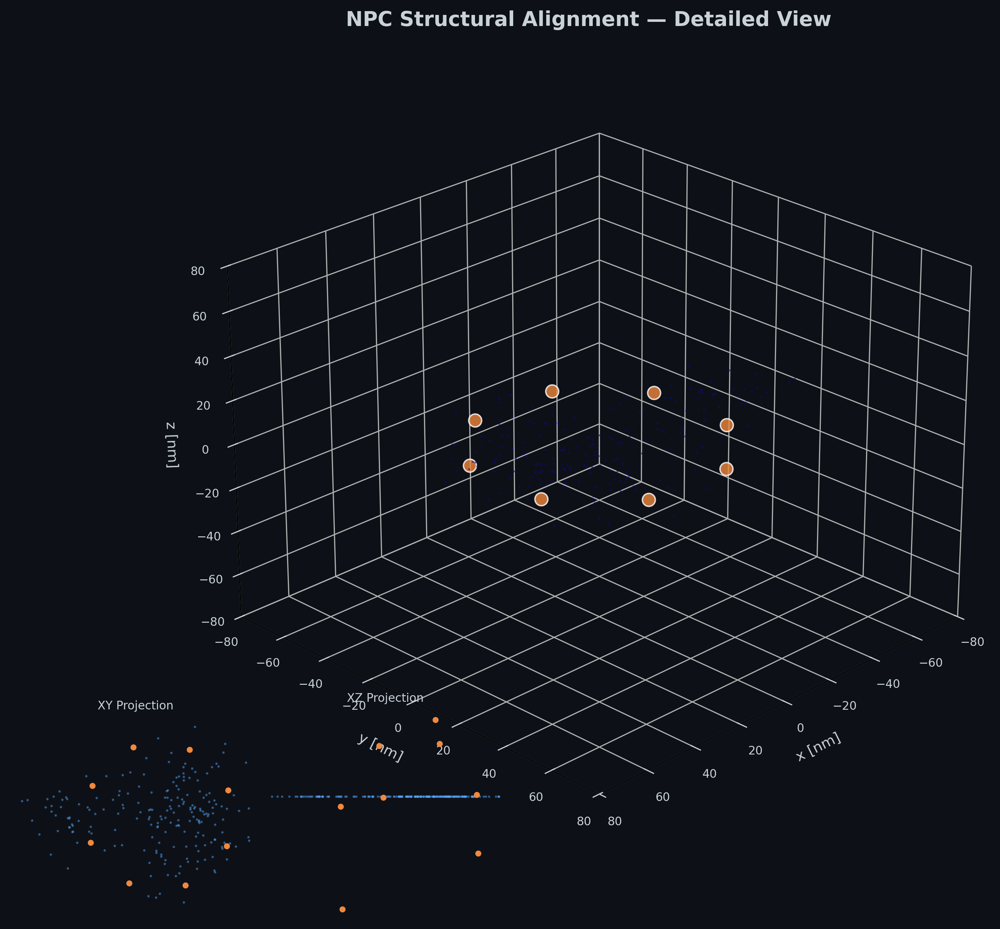
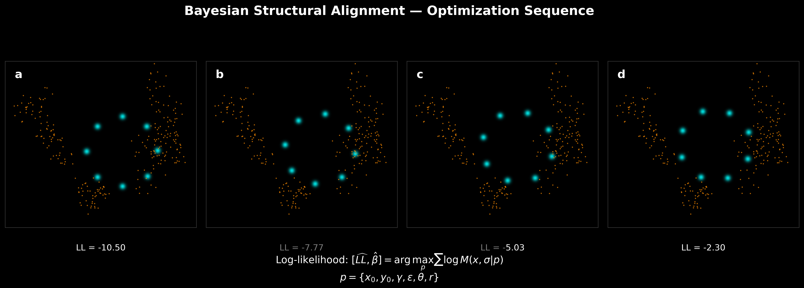

# SMLM-IMP Score

Bayesian scoring of Single-Molecule Localization Microscopy (SMLM) data against Integrative Modeling Platform (IMP) structural models of the Nuclear Pore Complex (NPC).

## Overview

**smlm_score** provides a complete pipeline for evaluating how well a structural model explains experimentally observed SMLM localization patterns. It implements three scoring functions based on Bayesian log-likelihood formulations (Bonomi et al. 2019), supports GPU-accelerated computation, and offers multiple optimization strategies for structural fitting.

## Features

- **Three scoring functions**: Tree (KD-tree), GMM (Gaussian Mixture Model), Distance (pairwise)
- **GPU acceleration**: CUDA kernels via Numba with automatic CPU fallback
- **Three optimization modes**:
  - Brownian Dynamics (geometric relaxation)
  - Conjugate Gradients (frequentist MLE)
  - Replica Exchange Monte Carlo (Bayesian posterior sampling with animated RMF trajectories)
- **Posterior density mapping**: Automatically generates MRC volumetric density maps and PNG heatmaps from Bayesian sampling ensembles, with score-based filtering and centroid alignment for publication-quality figures
- **HDBSCAN clustering**: Automated NPC isolation from dense SMLM fields
- **PCA alignment**: Model-data registration
- **Validation framework**: 2D-aware alignment and robust model-vs-null structural cross-validation
- **97 pytest tests**: Unit, integration, and robustness coverage

## Installation

### Prerequisites

- Python >= 3.11
- [IMP](https://integrativemodeling.org/) with the `IMP.bff` module
- CUDA toolkit (optional, for GPU acceleration)
- EMAN2 (optional, only for particle-picking workflows)

### Setup

```bash
git clone https://github.com/danielrieger/test.git
cd test
python -m pip install -r requirements.txt
python -m pip install -e .
```

### Environment

This project was developed with a conda-pack environment (Python 3.11). Core Python dependencies are listed in `requirements.txt`; package metadata is in `pyproject.toml`.

IMP is the main non-standard dependency. Install it separately following the [IMP installation guide](https://integrativemodeling.org/nightly/doc/manual/installation.html), and verify that `python -c "import IMP, IMP.bff"` works in the same environment used for this repository.

`environment.toml` documents the original local Windows environment. It is useful as a reference, but its absolute paths are machine-specific and should not be copied unchanged on another computer.

### Documentation

For mathematical details and current method limitations, see:

- [Scoring Models and Mathematical Formulations](docs/scoring_models.md)
- [GMM Overview and Roadmap](docs/gmm_overview_and_roadmap.md)
- [Posterior AV Density Mapping](docs/posterior_density.md)
- [EMAN2 Particle Picking Workflow](docs/eman2_workflow.md)

## Input Data

The large input data are **not included** in this repository. Download `smlm_data.zip` from Google Drive:

[Download smlm_data.zip](https://drive.google.com/file/d/1sIxsT4pOP84Gcn6Pubpu_rrapwKZRg5R/view?usp=sharing)

Extract the archive into `examples/` so that the repository contains the following local-only folders:

| Path after extraction | Size | Purpose |
|------|------|---------|
| `examples/PDB_Data/7N85-assembly1.cif` | 112 MB | NPC structural model from [RCSB PDB: 7N85](https://www.rcsb.org/structure/7N85) |
| `examples/ShareLoc_Data/data.csv` | 29 MB | SMLM localization table |

The default example configuration also uses small metadata files that stay in Git:

| Path | Purpose |
|------|---------|
| `examples/av_parameter.json` | Dye-accessible-volume setup: chains, residue, atom, and linker parameters |
| `examples/info/micrograph_info.json` | EMAN2-picked box centers used when `clustering.method` is `eman2` |
| `examples/pixel_map.json` | Pixel-to-nanometer conversion for EMAN2 boxes |

The SMLM CSV is expected to contain `x [nm]`, `y [nm]`, and `Amplitude_0_0`. If `z [nm]` is absent, the pipeline fills it with `0.0` for 2D workflows.

These input folders are ignored by Git and should stay local. Generated output directories such as `bayesian_cluster_*`, `frequentist_cluster_*`, and `brownian_cluster_*` are also local-only and should not be committed.

## Visual Gallery

The pipeline generates publication-quality visualizations for structural alignment, quality control, and Bayesian posterior analysis.

````carousel

<!-- slide -->

<!-- slide -->

<!-- slide -->

<!-- slide -->

<!-- slide -->

````

## Performance Benchmarking

A core technical contribution of this work is the implementation of a **Gaussian Mixture Model (GMM)** scoring engine that achieves constant-time evaluation relative to the number of experimental localizations ($N$).

- **Distance/Tree Engines**: Scale linearly $O(N)$ or $O(N \log N)$, becoming a bottleneck at $>10,000$ points.
- **GMM Engine**: After an initial $O(N)$ fitting step, evaluation complexity is $O(GK)$, where $G$ is the number of Gaussians and $K$ is the number of subunits. This results in **constant-time performance** for Bayesian optimization.


## Quick Start

1. **Setup**: Clone the repo and install the environment (see Setup above).
2. **Data**: Download `smlm_data.zip` from the link above and extract `PDB_Data/` and `ShareLoc_Data/` into `examples/`.
3. **Check the installation**:
   ```bash
   python -c "import smlm_score; import IMP; import IMP.bff; print('ok')"
   ```
4. **Review configuration**: open `examples/pipeline_config.json`. For a lightweight first run, reduce `optimization.bayesian.number_of_frames`.
5. **Run Pipeline**: `python examples/NPC_example_BD.py`
6. **Generate Thesis Figures**:
   - `python examples/visualize_alignment_stylized_3d.py` (3D Gallery)
   - `python examples/visualize_gmm_selection.py` (BIC & GMM QC)
   - `python examples/benchmark_scoring.py` (Performance Scaling)

## Project Structure

```
smlm_score/
|-- src/smlm_score/
|   |-- imp_modeling/
|   |   |-- scoring/       # Tree, GMM, Distance scoring + CUDA kernels
|   |   |-- restraint/     # IMP restraint wrappers
|   |   `-- simulation/    # Brownian, frequentist, and Bayesian optimization
|   |-- utility/           # Input, filtering, clustering, AV setup, visualization
|   `-- validation/        # Model-vs-null and cross-validation routines
|-- examples/              # Runnable workflows, configs, and figure scripts
|-- docs/                  # Method notes and workflow documentation
`-- tests/                 # Unit and integration tests
```

## Advanced Workflows

### 1. Bayesian Trajectory Visualization (RMF)
When running in `bayesian` optimization mode, the pipeline generates two state-of-the-art RMF3 trajectories in the output directory (e.g., `bayesian_cluster_11/`):
- `av_trajectory.rmf3`: A lightweight file containing only the moving fluorophore center points (AVs).
- `full_trajectory.rmf3`: A high-fidelity reconstruction containing all ~15,000 protein beads. The structural pose is recovered from sampled AV coordinates using a rigid-body SVD transformation (Kabsch algorithm).

**To visualize in ChimeraX:**
1. Open `full_trajectory.rmf3`.
2. Use the **Log** or **Tools > General > Playback** to animate the REMC sampling steps.
3. You will see the entire protein assembly moving as a unified rigid body.

### 2. Posterior AV Density Mapping
At the end of every Bayesian run, the pipeline automatically generates a probability density map of the 8 dye-attachment points (AVs) across the full sampling ensemble.

Key features of the density engine:
- **Score-based filtering**: Only the top 25% best-scoring frames are accumulated, discarding high-temperature exploratory poses.
- **Centroid alignment**: Each frame is centered to its AV centroid before accumulation, removing rigid-body translational drift and revealing true structural uncertainty.
- **MRC + PNG output**: Density maps are saved in MRC format (ChimeraX-ready) and as annotated heatmaps.
- **Auto-export**: PNGs are automatically copied to `examples/figures/Posterior/` with a frame-count suffix.

For a detailed technical description, see: [Posterior AV Density Mapping](docs/posterior_density.md).

### 3. EMAN2 Particle Picking (High-Res 5nm)
The pipeline supports state-of-the-art particle picking using EMAN2's neural network autoboxing on high-resolution (5nm) intensity-weighted density maps.

For a detailed step-by-step guide, see: [EMAN2 Workflow & High-Res Picking](docs/eman2_workflow.md).

**Key Upgrades:**
- **5 nm/pixel** resolution for structural clarity.
- **Intensity-weighted** rendering using `Amplitude_0_0`.
- **Targeted Modeling** of 300+ picked NPCs.

*Technical Note: If your box metadata is lost, use `examples/recover_boxes.py` to rebuild it from existing CSV fragments.*

## Repository Hygiene

The GitHub repository is intended to contain source code, documentation, lightweight configuration files, tests, and selected final figures. It should not contain raw input data or generated simulation outputs.

Keep these paths local or in external storage:

- `examples/PDB_Data/`
- `examples/ShareLoc_Data/`
- `smlm_data.zip`
- `bayesian_cluster_*/`, `frequentist_cluster_*/`, `brownian_cluster_*/`
- `examples/bayesian_cluster_*/`, `examples/frequentist_cluster_*/`, `examples/brownian_cluster_*/`
- `*.rmf`, `*.rmf3`, `*.mrc`, `*.hdf`

If a generated file is needed for a thesis figure, document how to reproduce it or store it in an external data package. Do not commit large intermediate trajectories or EMAN2 training outputs.

## Maintenance & Data Safety

### Synchronization (Windows/WSL)
Because input data (PDBs, SMLM CSVs) and EMAN2 results are often excluded from Git due to size, use the provided `safe_sync.sh` script to align development environments:

```bash
# In WSL:
./safe_sync.sh
```

This script uses `rsync --update` and explicit excludes to ensure that **untracked local data in WSL is never deleted or overwritten** when pulling code updates from the Windows "Source of Truth" workspace.

## Validation

The validation module implements a robust, EMAN2-aware validation framework:
1. **2D-Aware Alignment**: Correctly handles flattened 2D EMAN2 data by intelligently skipping PCA rotation while preserving XY centering.
2. **Model-vs-Null Structural Validation**: Rigorously evaluates the *best optimized structural pose* from the Bayesian sampler. It splits the localizations into train/test folds and scores the fit against distinct null models:
   - For 3D data: Scrambled points, Rotated model, Mirrored model, Radial randomized points.
   - For 2D data: Scrambled points, Translated model (off-center shift), Radial points, Radial + Translated model. (Rotations and mirroring are replaced by translation since EMAN2 boxes are already projection-centered).
3. **Fallback Separation**: If pure noise clusters are present, verifies that valid NPC clusters score higher than noise (gracefully skipped if only valid NPCs exist).

## License

TBD

## Testing

```bash
pytest tests/
```

Expected result: **98 passed, 5 skipped** (skipped tests require CUDA or depend on specific validation thresholds).

## Citation

TBD
