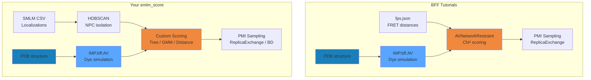

# Code Assessment: smlm_score vs Tutorials

## Quick Summary

| Tutorial Concept | Your Code Status | Notes |
|:---|:---:|:---|
| IMP Model / Particle / XYZ | ✅ Correct | `input.py`, `data_handling.py` |
| IMP.bff AV computation | ✅ Correct | `compute_av()` matches BFF pattern |
| `AVNetworkRestraint` (FRET) | ✅ Implemented | [imp_restraint.py](file:///c:/Users/User/OneDrive/Desktop/Thesis/smlm_score/src/imp_modeling/restraint/imp_restraint.py) line 70 |
| PMI `RestraintBase` wrapping | ✅ Correct | Both `AVNetworkRestraintWrapper` and `ScoringRestraintWrapper` |
| `IMP.pmi.macros.ReplicaExchange` | ✅ Implemented | [mcmc_sampler.py](file:///c:/Users/User/OneDrive/Desktop/Thesis/smlm_score/src/imp_modeling/simulation/mcmc_sampler.py) |
| fps.json for FRET distances | ⚠️ Not used | Your data is SMLM localisations, not FRET pairs — this is **by design** |
| Custom scoring (Tree/GMM/Distance) | ✅ Novel | Goes **beyond** tutorials — thesis contribution |
| HDBSCAN clustering | ✅ Just added | `isolate_individual_npcs()` — aligned with IMP best practices |
| Brownian Dynamics sampling | ✅ Implemented | `simulation_setup.py` |
| tttrlib (TTTR/FLIM/FCS) | ❌ Not applicable | tttrlib is for photon counting, not SMLM point clouds |

---

## Detailed Analysis

### 1. IMP Core — Model/Particle/Restraint Pattern ✅

**Tutorial pattern** (IMP library tutorial):
```
m = IMP.Model()
p = IMP.Particle(m)
IMP.core.XYZ.setup_particle(p, coords)
restraint = IMP.core.SingletonRestraint(...)
m.add_restraint(restraint)
```

**Your code** follows this correctly in `compute_av()` and scoring:
- Creates `IMP.Model()`, reads mmCIF, creates `IMP.Particle` for AV setup
- Uses `IMP.core.XYZ(av).get_coordinates()` for model coordinates
- Wraps custom scoring in `IMP.pmi.restraints.RestraintBase`

> [!TIP]
> This is fully aligned. No changes needed.

### 2. IMP.bff AV Setup ✅

**BFF tutorial pattern** (mGBP2, T4L examples):
```python
fps_json_path = "fret.fps.json"
fret_restraint = IMP.bff.AVNetworkRestraint(hier, fps_json_path, score_set=score_set)
v = fret_restraint.unprotected_evaluate(None)
```

**Your code** has two approaches:
1. **`imp_restraint.py`**: Wraps `IMP.bff.AVNetworkRestraint` in PMI — matches tutorial exactly
2. **`data_handling.py` / `compute_av()`**: Uses `IMP.bff.AV.do_setup_particle()` directly for AV computation, then feeds into *custom* scoring functions (Tree/GMM/Distance) instead of FRET scoring

> [!IMPORTANT]
> **This distinction is your thesis contribution.** The tutorials score via FRET distances (donor-acceptor pairs). Your code scores via SMLM localisation density. Both use the same AV computation from IMP.bff.

### 3. Custom Scoring Functions — Beyond Tutorials ✅

Your code adds three scoring approaches not in any tutorial:

| Score | File | Method |
|:---|:---|:---|
| Tree | [tree_score.py](file:///c:/Users/User/OneDrive/Desktop/Thesis/smlm_score/src/imp_modeling/scoring/tree_score.py) | KDTree-based proximity score |
| GMM | [gmm_score.py](file:///c:/Users/User/OneDrive/Desktop/Thesis/smlm_score/src/imp_modeling/scoring/gmm_score.py) | Gaussian Mixture Model likelihood |
| Distance | [distance_score.py](file:///c:/Users/User/OneDrive/Desktop/Thesis/smlm_score/src/imp_modeling/scoring/distance_score.py) | Exponential distance penalty (Wu et al. 2023) |

These are wrapped in `ScoringRestraintWrapper(IMP.pmi.restraints.RestraintBase)` — the PMI pattern is correct.

### 4. PMI Integration ✅

**Tutorial pattern** (mGBP2):
```python
bs = IMP.pmi.macros.BuildSystem(mdl, resolutions=[1])
bs.add_state(reader)
hier, dof = bs.execute_macro()
IMP.pmi.tools.add_restraint_to_model(mdl, restraint.rs, True)
rex = IMP.pmi.macros.ReplicaExchange(...)
```

**Your code** uses PMI correctly:
- `mcmc_sampler.py`: `IMP.pmi.dof.DegreesOfFreedom`, `IMP.pmi.macros.ReplicaExchange`
- `scoring_restraint.py`: `ScoringRestraintWrapper(IMP.pmi.restraints.RestraintBase)`
- `imp_restraint.py`: `AVNetworkRestraintWrapper(IMP.pmi.restraints.RestraintBase)`

### 5. tttrlib — Not Applicable ❌

tttrlib handles TTTR data (photon arrival times for FCS, FLIM, single-molecule fluorescence). Your SMLM data comes as localisation coordinates from ShareLoc CSV — this is **downstream** of the image reconstruction. tttrlib would be relevant if you were doing the SMLM reconstruction from raw photon data yourself, which you're not.

---

## Gaps and Potential Improvements

### A. Missing: `fps.json` integration ⚠️

The BFF tutorials use `fps.json` files for experimental distance data. Your `av_parameter.json` defines AV setup (linker length, dye radii), but you don't use `fps.json` for scoring via `AVNetworkRestraint`. This is fine since you're scoring against SMLM point clouds, not FRET distances.

**Suggestion**: In the thesis, clearly explain why you don't use `AVNetworkRestraint` scoring: your data is localisations, not inter-dye distances.

### B. Missing: Excluded Volume / Connectivity Restraints ⚠️

The mGBP2 tutorial uses:
- `IMP.pmi.restraints.stereochemistry.ConnectivityRestraint` 
- `IMP.pmi.restraints.stereochemistry.ExcludedVolumeSphere`

Your Brownian Dynamics simulation doesn't include these. For NPC modeling this matters less (NPC is symmetric, well-constrained), but adding excluded volume could prevent unphysical model overlaps during sampliing.

### C. Score Comparison panel incomplete ⚠️

Figure 3 (score comparison) shows only Tree score. GMM and Distance panels are empty — those scoring paths aren't called in `visualize_results.py`.

### D. Per-NPC model alignment ⚠️

The current code overlays the **same** model AV positions on every NPC cluster (shifted to centroid). Each NPC may be rotated/tilted differently. The BFF tutorials use rigid body transformations for structural alignment — consider using PCA + rotation fitting per-cluster.

---

## Architecture Comparison



**Key difference**: Tutorials go PDB → AV → FRET scoring. You go PDB → AV + SMLM → custom density scoring. The AV computation and PMI framework usage are identical.
