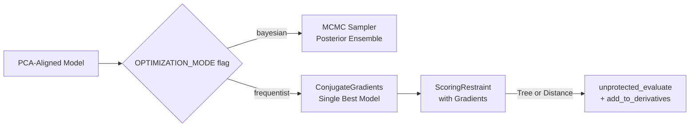

# Frequentist Optimization Pipeline

Add a gradient-based (MLE) optimization path to the existing Bayesian MCMC pipeline, selectable via a flag. Instead of sampling a posterior distribution, a local optimizer drives the IMP model to a single best-fit structure.

## User Review Required

> [!IMPORTANT]
> **No GMM support.** GMM's likelihood is computed on the *fitted Gaussian parameters*, not on the raw data points. Moving the IMP model particles does not change the GMM landscape—the gradient is always zero w.r.t. model coordinates. Only **Distance** and **Tree** scores have a true model-dependent gradient and are suitable for optimization.

> [!WARNING]
> **Local minimum risk.** Gradient optimizers (ConjugateGradients) will find the *nearest* local minimum from the PCA-aligned starting point. Unlike MCMC which explores broadly, the frequentist result is heavily dependent on initialization. This is expected behavior for MLE and should be mentioned in the thesis.

## Architecture Overview



## Proposed Changes

### Scoring Layer — Analytical Gradients

#### [MODIFY] [distance_score.py](file:///c:/Users/User/OneDrive/Desktop/Thesis/smlm_score/src/imp_modeling/scoring/distance_score.py)

Add a new Numba function `_compute_distance_score_and_grad_cpu` that returns both the scalar score **and** a `(M, 3)` gradient array. The gradient of the log-likelihood w.r.t. model point $\mathbf{x}_m$ is:

$$\nabla_{\mathbf{x}_m} \mathcal{L} = \sum_i w_i \cdot \Sigma^{-1}(\mathbf{x}_m - \mathbf{x}_{d,i}) \cdot \frac{p_i}{\sum_j p_j}$$

where $p_i$ is the Gaussian contribution of data point $i$ to model point $m$, normalized via the LogSumExp trick already in the code. The existing `_compute_distance_score_cpu` remains untouched for backward compatibility.

---

#### [MODIFY] [tree_score.py](file:///c:/Users/User/OneDrive/Desktop/Thesis/smlm_score/src/imp_modeling/scoring/tree_score.py)

Add a companion function `computescoretree_with_grad` that, for each model point, computes the gradient over its KDTree neighbors:

$$\nabla_{\mathbf{x}_m} \mathcal{L}_{\text{tree}} = \sum_{i \in \text{neighbors}(m)} \frac{-(\mathbf{x}_m - \mathbf{x}_{d,i})}{\sigma_i^2}$$

This is simpler than the Distance gradient because the Tree score uses isotropic Gaussians without the LogSumExp mixture.

---

### Restraint Layer — Derivative Propagation

#### [MODIFY] [scoring_restraint.py](file:///c:/Users/User/OneDrive/Desktop/Thesis/smlm_score/src/imp_modeling/restraint/scoring_restraint.py)

* Modify `ScoringRestraintDistance.unprotected_evaluate(da)` and `ScoringRestraintTree.unprotected_evaluate(da)`:
  - When `da` (DerivativeAccumulator) is not `None`, call the new `*_with_grad` functions.
  - For each AV particle, call `IMP.core.XYZ(p).add_to_derivatives(grad_vector, da)` to push the gradient into IMP's internal accumulator.
  - When `da` is `None` (pure evaluation, e.g. during MCMC), call the existing functions unchanged.

---

### Optimizer Module

#### [NEW] [frequentist_optimizer.py](file:///c:/Users/User/OneDrive/Desktop/Thesis/smlm_score/src/imp_modeling/simulation/frequentist_optimizer.py)

New module mirroring the structure of `mcmc_sampler.py`:

```python
def run_frequentist_optimization(
    model, pdb_hierarchy, avs, scoring_restraint_wrapper,
    output_dir="frequentist_output",
    max_cg_steps=200,
    convergence_threshold=1e-4
):
    """
    Runs IMP.core.ConjugateGradients to find the single
    Maximum-Likelihood structure.
    """
```

* Sets up `IMP.core.ConjugateGradients(model)` optimizer.
* Configures the scoring function from the `ScoringRestraintWrapper`.
* Runs `cg.optimize(max_cg_steps)`.
* Saves the optimized structure to an RMF file.
* Returns the final score and optimized coordinates.

---

### Pipeline Script

#### [MODIFY] [NPC_example_BD.py](file:///c:/Users/User/OneDrive/Desktop/Thesis/smlm_score/examples/NPC_example_BD.py)

Add a new top-level flag:

```python
OPTIMIZATION_MODE = "bayesian"  # "bayesian" or "frequentist"
FREQUENTIST_SCORING_TYPE = "Tree"  # Only "Tree" or "Distance"
```

In the Stage 8 block (currently lines 254–277), add an `elif` branch:

```python
if OPTIMIZATION_MODE == "bayesian":
    # ... existing MCMC code ...
elif OPTIMIZATION_MODE == "frequentist":
    run_frequentist_optimization(
        model=m, pdb_hierarchy=pdb_hierarchy, avs=avs,
        scoring_restraint_wrapper=sr_wrapper,
        output_dir=f"frequentist_output_cluster_{cluster_idx}_{SCORING_TYPE}"
    )
```

---

## Verification Plan

### Automated Tests

#### [NEW] [test_frequentist_optimizer.py](file:///c:/Users/User/OneDrive/Desktop/Thesis/smlm_score/tests/test_frequentist_optimizer.py)

1. **Gradient Correctness (Finite Differences)**
   - For both Distance and Tree: perturb each model coordinate by $\epsilon=10^{-5}$, compute the numerical gradient via $(f(x+\epsilon) - f(x-\epsilon)) / 2\epsilon$, and assert it matches the analytical gradient to $< 10^{-3}$ relative error.

2. **Optimizer Convergence**
   - Start from a deliberately misaligned model (shifted by 10nm).
   - Run `ConjugateGradients` for 200 steps.
   - Assert that the final score is strictly better (less negative → closer to zero) than the initial score.
   - Assert that the model coordinates moved toward the data centroid.

### Manual Verification
- Run `NPC_example_BD.py` with `OPTIMIZATION_MODE = "frequentist"` and compare the resulting RMF structure against the Bayesian ensemble to confirm the MLE sits within the posterior credible region.
