# EMAN2 Neural Network Particle Picking — HDBSCAN Replacement

## Background

The current pipeline uses HDBSCAN (in [data_handling.py](file:///c:/Users/User/OneDrive/Desktop/Thesis/smlm_score/src/smlm_score/utility/data_handling.py#L215-L359)) to isolate individual NPC clusters from SMLM point clouds. While HDBSCAN works, it:
- Struggles with dense background noise (produces many small "noise clusters")
- Requires a secondary geometric merging step (AgglomerativeClustering) to reassemble fragmented NPCs
- Has no concept of what an NPC actually *looks like* — it only uses point density

EMAN2's neural network picker can learn the visual *shape* of an NPC and pick them far more reliably.

## User Review Required

> [!IMPORTANT]
> **Your `eman2` environment already exists and is fully functional!**
> - Python 3.12.13, EMAN2 2.99.72 (GUI variant)
> - TensorFlow 2.19.1 with CUDA 12.9 (for neural network training/inference)
> - PyQt5 + PyOpenGL (for the `e2boxer.py` GUI)
> - No compilation needed — it was installed from the `cryoem` conda channel as a pre-built package.

> [!WARNING]
> **The neural network picker requires a one-time GUI training session.** You open `e2boxer.py`, circle ~10–50 good NPCs and ~50 bad examples on the rendered micrograph, and click "Train." After that, all subsequent picking is headless CLI. **The entire micrograph (full map) is used for training**, which is ideal because you can cherry-pick the clearest NPC examples from anywhere in the image.

> [!NOTE]
> **WSLg is already installed** (version 1.0.71). The `xcalc` failure was because the X11 apps package isn't installed, not because GUI forwarding is broken. We just need `sudo apt install x11-apps`.

---

## Phase 1 — Fix WSLg GUI Support (~2 min)

WSLg 1.0.71 is already present. The X11 socket `/tmp/.X11-unix/X0` exists. We just need the missing packages.

### Steps
```bash
sudo apt update
sudo apt install -y x11-apps mesa-utils libgl1-mesa-glx
xcalc   # verify: calculator window should appear on Windows desktop
```

---

## Phase 2 — Prepare the `eman2` Environment (~5 min)

The environment already has EMAN2 + TensorFlow. We only need to add `mrcfile` for the rendering script.

### What is `mrcfile`?

`mrcfile` is a lightweight Python library (~100 KB) for reading and writing MRC/CRC image files — the standard format used by Cryo-EM software including EMAN2. We need it in **both** environments:

| Environment | Why `mrcfile` is needed |
|---|---|
| **`smlm`** | The `smlm_to_mrc.py` script runs here to convert your SMLM point cloud (`data.csv`) into a 2D density image that EMAN2 can read |
| **`eman2`** | Optional — EMAN2 has its own MRC I/O via `EMAN2.EMData`, but having `mrcfile` allows the reverse-translation script (`eman_boxes_to_smlm.py`) to run in either environment |

`mrcfile` has only one dependency (`numpy`) and will not interfere with either environment.

### Steps
```bash
# In the smlm environment
conda activate smlm
pip install mrcfile

# In the eman2 environment
conda activate eman2
pip install mrcfile
```

---

## Phase 3 — SMLM → Micrograph Rendering

#### [NEW] `examples/smlm_to_mrc.py` (runs in `smlm` environment)

**What it does:**
1. Reads `ShareLoc_Data/data.csv` (columns: `x [nm]`, `y [nm]`, `frame`, ...)
2. Builds a 2D histogram at configurable resolution (default: 10 nm/pixel)
3. Applies Gaussian blur (σ = 2–3 pixels) so discrete localizations merge into continuous density
4. Inverts contrast (EMAN2 expects dark particles on bright background)
5. Saves as `micrograph.mrc`
6. Saves coordinate-to-pixel mapping as `pixel_map.json` for reverse translation

**Key parameters:**
| Parameter | Default | Purpose |
|---|---|---|
| `--pixel_size_nm` | 10 | nm per pixel in the rendered image |
| `--sigma_px` | 2.5 | Gaussian blur radius (pixels) |
| `--invert` | True | Invert contrast for EMAN2 compatibility |

Your data spans ~15,000 × 15,000 nm → produces a ~1500×1500 pixel image at 10 nm/px.

---

## Phase 4 — EMAN2 Neural Network Particle Picking

### Stage A: GUI Training (one-time, ~15 min)

The **entire rendered micrograph** is loaded in the GUI, so you can scroll across the full map and pick the best NPC examples from anywhere — perfect rings, clean isolated ones, etc.

```bash
conda activate eman2
cd ~/Thesis/smlm_score/examples
e2boxer.py micrograph.mrc
```

In the GUI:
1. Set **box size** = 32 (at 10 nm/px this captures 320×320 nm — enough for an NPC with padding)
2. Select **Neural Net** in the Autoboxing Methods panel
3. Pick training examples:
   - **Good Refs** (~10–50 clearly visible, well-centered NPCs)
   - **Bad Refs** (~50+ noise blobs, edge artifacts, partial structures)
   - **Background Refs** (empty regions)
4. Click **Train** → the CNN learns on GPU via TensorFlow
5. Click **Auto pick** to see results on the current micrograph and refine
6. The trained model is saved to the EMAN2 project database

### Stage B: Headless Batch Picking (automated, repeatable)

Once trained, picking is a single CLI command:

```bash
conda activate eman2
e2boxer.py micrograph.mrc --autopick=nn:threshold=0.5 --write_ptcls
```

Output:
- `info/micrograph_info.json` — box center coordinates (pixels) and box size
- `particles/` — extracted particle sub-images

The `threshold` parameter (0–1) controls sensitivity. Lower = more particles picked (more false positives). Higher = fewer, more confident picks.

---

## Phase 5 — Box → SMLM Reverse Translation

#### [NEW] `examples/eman_boxes_to_smlm.py` (runs in `smlm` environment)

**What it does:**
1. Reads EMAN2 box coordinates from `info/micrograph_info.json`
2. Reads `pixel_map.json` to convert pixel coords → nanometers
3. For each box, extracts all SMLM localizations from `data.csv` within the box boundary
4. Outputs individual cluster files: `picked_npc_0.csv`, `picked_npc_1.csv`, ...

---

## Phase 6 — Pipeline Integration

#### [MODIFY] `pipeline_config.json`

```json
{
  "clustering": {
    "method": "eman2",
    "eman2_boxes": "info/micrograph_info.json",
    "pixel_map": "pixel_map.json",
    "perform_geometric_merging": true,
    "min_cluster_size": 15,
    "min_npc_points": 50
  }
}
```

When `method` is `"hdbscan"`, the pipeline uses the existing `isolate_individual_npcs()`. When `"eman2"`, it uses the new function.

#### [MODIFY] `src/smlm_score/utility/data_handling.py`

Add `isolate_npcs_from_eman2_boxes()` that:
- Reads the box file and pixel map
- Converts pixel boxes → nanometer bounding rectangles
- Filters `smlm_data` into clusters by box membership
- Returns the same dict format as `isolate_individual_npcs()` → rest of pipeline unchanged

#### [MODIFY] `examples/NPC_example_BD.py`

At line ~118, branch on config:
```python
if config["clustering"]["method"] == "eman2":
    npc_results = isolate_npcs_from_eman2_boxes(
        smlm_coordinates_for_tree,
        boxes_path=config["clustering"]["eman2_boxes"],
        pixel_map_path=config["clustering"]["pixel_map"],
    )
else:
    npc_results = isolate_individual_npcs(...)  # existing HDBSCAN code
```

---

## End-to-End Workflow Summary

```mermaid
graph TD
    A["data.csv<br/>SMLM localizations"] --> B["smlm_to_mrc.py<br/>(smlm env)"]
    B --> C["micrograph.mrc"]
    C --> D["e2boxer.py GUI<br/>(eman2 env)<br/>Train NN once"]
    D --> E["Trained NN model"]
    E --> F["e2boxer.py CLI<br/>(eman2 env)<br/>Headless picking"]
    F --> G["info/micrograph_info.json<br/>Box coordinates"]
    G --> H["eman_boxes_to_smlm.py<br/>(smlm env)"]
    H --> I["NPC cluster CSVs"]
    I --> J["NPC_example_BD.py<br/>IMP modeling pipeline"]
    
    style A fill:#2d5a27
    style C fill:#1a4a6e
    style G fill:#1a4a6e
    style I fill:#2d5a27
    style J fill:#6e1a1a
```



---

## Execution Order

| Step | Action | Env | Time |
|------|--------|-----|------|
| 1 | Install X11 apps for WSLg | system | 2 min |
| 2 | `pip install mrcfile` in both envs | smlm + eman2 | 1 min |
| 3 | Write `smlm_to_mrc.py` | smlm | — |
| 4 | Run `smlm_to_mrc.py` to render micrograph | smlm | 1 min |
| 5 | Open `e2boxer.py` GUI, train NN on full map | eman2 | 15 min |
| 6 | Run headless `e2boxer.py` CLI picking | eman2 | 1 min |
| 7 | Write `eman_boxes_to_smlm.py` | smlm | — |
| 8 | Write `isolate_npcs_from_eman2_boxes()` in data_handling.py | smlm | — |
| 9 | Update pipeline_config.json and NPC_example_BD.py | smlm | — |
| 10 | Run full pipeline with EMAN2 picking | smlm | ~15 min |

## Verification Plan

### Automated Tests
- `e2version.py` works ✅ (already verified)
- `xcalc` pops up after X11 install
- `smlm_to_mrc.py` produces valid `.mrc` readable by `e2display.py`
- Round-trip: render → pick → extract → verify extracted points ⊂ original data

### Manual Verification
- Open `micrograph.mrc` in `e2display.py` — NPCs should appear as distinct ring-shaped density blobs
- Side-by-side comparison: EMAN2-picked clusters vs. HDBSCAN clusters
- Run full pipeline with both methods and compare validation scores
